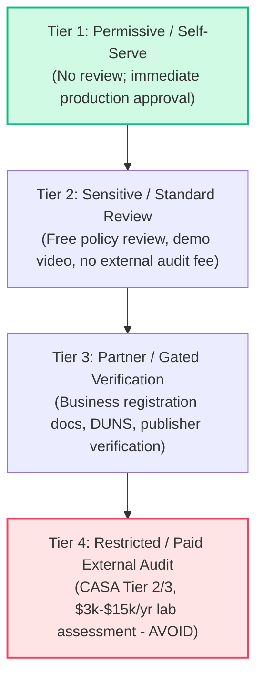

# Fenr & Nabu Integrations Reference Architecture

This documentation directory contains comprehensive technical specifications, API scopes, endpoints, rate limits, and verification requirements for all 25 core third-party integrations planned for the **Fenr** platform and **Nabu** agent runtime.

---

## The Compliance & Audit Spectrum

When integrating third-party platforms into a SaaS application, API permissions are divided into regulatory tiers. Choosing the wrong scope can trigger mandatory, recurring third-party security audits (e.g., CASA Tier 2/3) costing **\$3,000 to \$15,000+ annually** per provider.

We classify every scope across four operational compliance tiers:

### 1. Tier 1: Permissive / Self-Serve
* **Requirements**: Developer account registration and OAuth app creation. Instant tokens in production.
* **Examples**: Linear, GitHub (fine-grained app permissions), Cal.com (API keys / OAuth), Figma (`files:read`), Dropbox.

### 2. Tier 2: Sensitive / Standard Functional Review
* **Requirements**: Privacy policy URL, Terms of Service, YouTube video demonstrating user consent and data usage. Reviewed asynchronously by the platform's trust & safety team for free.
* **Examples**: Google Calendar (`calendar.events`), Google Drive per-file access (`drive.file`), Slack App Directory review, Zoom Marketplace review, Notion public integration review.

### 3. Tier 3: Partner / Gated Business Verification
* **Requirements**: Legal entity verification, D-U-N-S number, verified utility bill, or formal partner program application.
* **Examples**: Microsoft Entra ID Publisher Verification (Cloud Partner Program), Meta / WhatsApp Business Verification, LinkedIn Marketing Developer Platform, Intuit App Assessment.

### 4. Tier 4: Restricted / Paid External Audit (AVOID / OFF THE TABLE)
* **Requirements**: Mandatory external security assessment conducted by an authorized testing lab (e.g. Bishop Fox, Leviathan Security Group) under Cloud Application Security Assessment (CASA) Tier 2 / Tier 3 standards.
* **Cost**: \$3,000 to \$15,000+ USD per year plus mandatory annual re-certification.
* **Examples**: Google Restricted Scopes (full Google Drive `auth/drive`, full Gmail `auth/gmail.modify`, `auth/gmail.readonly`, `auth/gmail.compose`).
* **Architecture Rule**: **Do not request Tier 4 restricted scopes.** Use surgical alternatives (e.g., `drive.file` via Google Picker, transactional SMTP/postmark instead of full personal Gmail read/modify).

---

## Directory of Integration Specifications

### 1. [Google Workspace Suite](./google/)
- [Gmail](./google/gmail.md) — Email drafting, sending, and metadata retrieval without CASA audit scopes.
- [Google Calendar](./google/calendar.md) — Event scheduling, free/busy lookup, attendee management.
- [Google Drive](./google/drive.md) — Per-file access (`drive.file`), Picker integration, and file sync.
- [Google Docs](./google/docs.md) — Document reading, text insertion, batch updates via Docs API.
- [Google Sheets](./google/sheets.md) — Spreadsheet reading, cell range updates, structured append.
- [Google Meet](./google/meet.md) — Meeting space creation, conference records, calendar attachments.

### 2. [Microsoft 365 Suite](./microsoft/)
- [Outlook (Mail & Calendar)](./microsoft/outlook.md) — Graph API mail handling and scheduling.
- [OneDrive](./microsoft/onedrive.md) — Drive items, delta sync, and file upload sessions.
- [Microsoft Teams](./microsoft/teams.md) — Channel messaging, chat threads, and Bot Framework integration.
- [Excel](./microsoft/excel.md) — Graph workbook APIs, worksheets, tables, and range calculations.
- [Microsoft 365 & Copilot](./microsoft/copilot.md) — Copilot Studio plugins, Graph connectors, declarative agents.

### 3. [Communication & Collaboration](./communication/)
- [Slack](./communication/slack.md) — Bot users, block kit UI, event subscriptions, thread replies.
- [WhatsApp](./communication/whatsapp.md) — Meta Cloud API, WABA system tokens, interactive messages.
- [Zoom](./communication/zoom.md) — Meeting scheduling, recording management, webhook event listeners.

### 4. [Project & Issue Tracking](./project-management/)
- [Linear](./project-management/linear.md) — GraphQL client, issue triage, project cycles, webhook ingestion.
- [Jira](./project-management/jira.md) — Atlassian 3LO, Cloud ID resolution, issue schemas, transitions.
- [ClickUp](./project-management/clickup.md) — Spaces, lists, tasks, custom fields, webhook handlers.

### 5. [Scheduling](./scheduling/)
- [Cal.com](./scheduling/cal-com.md) — v2 REST API, booking slots, event webhooks, open-source hosting.
- [Calendly](./scheduling/calendly.md) — OAuth 2.0, event types, scheduled meetings, webhook subscriptions.

### 6. [Developer & Design](./developer-design/)
- [GitHub](./developer-design/github.md) — GitHub App installations, pull requests, issues, repo search.
- [Figma](./developer-design/figma.md) — REST API, node inspection, design tokens, comment tracking.

### 7. [Knowledge & Storage](./knowledge-storage/)
- [Notion](./knowledge-storage/notion.md) — Block tree parsing, database queries, page creation.
- [Dropbox](./knowledge-storage/dropbox.md) — File sync, cursors, temporary links, chunked uploads.

### 8. [Business, Social & Finance](./business/)
- [LinkedIn](./business/linkedin.md) — Social share API, profile verification, organization updates.
- [QuickBooks](./business/quickbooks.md) — Intuit OAuth 2.0, `realmId` routing, customer invoices, ledger sync.
