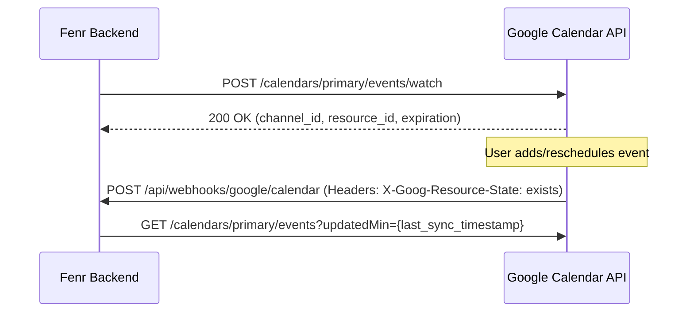

# Google Calendar Integration Specification

## 1. Overview & Agentic Capabilities

The Google Calendar integration allows **Nabu** and **Fenr** to:
* **Schedule & Manage Meetings**: Create, reschedule, and cancel calendar events with Google Meet links.
* **Conflict & Availability Checks (Free/Busy)**: Query real-time availability across attendees before booking.
* **Daily Briefing & Meeting Context**: Fetch upcoming agenda items, attendee lists, and event descriptions for pre-meeting summaries.
* **Time Blocking**: Automate focus blocks and task scheduling based on Fenr tasks and project deadlines.

---

## 2. OAuth 2.0 & Scope Classification

Unlike Gmail, **Google Calendar scopes are classified as Sensitive, NOT Restricted**.
This means **no mandatory CASA Tier 2/3 paid security audit is required**.
Verification is a standard, free Google Trust & Safety review requiring:
1. A valid Privacy Policy and Terms of Service.
2. A YouTube video demonstrating the OAuth consent screen and event creation feature.

```
┌─────────────────────────────────────────────────────────────────────────────┐
│                      CALENDAR SCOPE CLASSIFICATION                          │
│                                                                             │
│  [Sensitive Scopes - Free Verification, NO CASA Audit Needed]               │
│  • https://www.googleapis.com/auth/calendar.events (Recommended)            │
│  • https://www.googleapis.com/auth/calendar.events.freebusy                 │
│  • https://www.googleapis.com/auth/calendar.readonly                        │
│                                                                             │
│  [Broad Scope - Sensitive]                                                  │
│  • https://www.googleapis.com/auth/calendar (Full access to calendars)      │
└─────────────────────────────────────────────────────────────────────────────┘
```

### Recommended Scopes

| Scope URI | Type | Purpose | Audit Fee? |
| :--- | :--- | :--- | :--- |
| `https://www.googleapis.com/auth/calendar.events` | Sensitive | Read, create, update, and delete calendar events. | **None (Free)** |
| `https://www.googleapis.com/auth/calendar.freebusy` | Sensitive | Read free/busy calendar information for scheduling. | **None (Free)** |

---

## 3. Core API Endpoints & Payload Contracts

All Calendar REST calls target `https://www.googleapis.com/calendar/v3/`.

### A. Query Availability (Free/Busy)
* **Endpoint**: `POST /freeBusy`
* **Payload**:
  ```json
  {
    "timeMin": "2026-09-25T09:00:00Z",
    "timeMax": "2026-09-25T18:00:00Z",
    "items": [
      { "id": "primary" },
      { "id": "colleague@example.com" }
    ]
  }
  ```
* **Response**: Returns busy intervals (`[start, end]`) for each participant.

### B. List Upcoming Events
* **Endpoint**: `GET /calendars/primary/events?timeMin={now}&singleEvents=true&orderBy=startTime&maxResults=20`
* **Response**: Chronological list of confirmed events, attendees, locations, and descriptions.

### C. Create Event with Google Meet Conference
* **Endpoint**: `POST /calendars/primary/events?conferenceDataVersion=1`
* **Payload**:
  ```json
  {
    "summary": "Product Review & Architecture Sync",
    "description": "Discussion on Fenr integration roadmap.",
    "start": {
      "dateTime": "2026-09-26T14:00:00Z",
      "timeZone": "UTC"
    },
    "end": {
      "dateTime": "2026-09-26T14:45:00Z",
      "timeZone": "UTC"
    },
    "attendees": [
      { "email": "client@example.com" }
    ],
    "conferenceData": {
      "createRequest": {
        "requestId": "fenr-meet-uuidv7",
        "conferenceSolutionKey": { "type": "hangoutsMeet" }
      }
    }
  }
  ```
* **Response**: Includes the generated `hangoutLink` (`https://meet.google.com/xxx-yyyy-zzz`).

---

## 4. Push Notifications & Event Ingestion

Calendar supports Webhook notifications via push channels:



* **Setup**: Call `POST /calendars/primary/events/watch` with a webhook address and unique channel UUID.
* **Expiration**: Webhook channels expire after up to **30 days**. A scheduled job must renew active channels before expiry.

---

## 5. Rate Limits & Quotas

* **Daily Request Quota**: 1,000,000,000 queries/day.
* **Per-User Concurrency Limit**: 500 requests per 100 seconds per user.
* **Error Status**: `403 rateLimitExceeded` / `429 Too Many Requests`.
* **Handling**: Standard exponential backoff with randomized jitter.

---

## 6. Nabu Tool Definition (Rust Agent Schema)

```rust
pub struct CalendarCreateEventArgs {
    pub title: String,
    pub description: Option<String>,
    pub start_time: chrono::DateTime<chrono::Utc>,
    pub end_time: chrono::DateTime<chrono::Utc>,
    pub attendees: Vec<String>,
    pub attach_google_meet: bool,
}

pub struct CalendarAvailabilityCheckArgs {
    pub target_date: chrono::NaiveDate,
    pub user_emails: Vec<String>,
}
```
