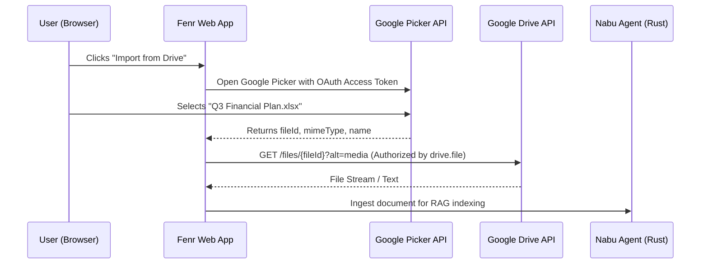

# Google Drive Integration Specification

## 1. Overview & Agentic Capabilities

The Google Drive integration allows **Fenr** and the **Nabu** agent to:
* **Import & Ingest Files**: Import documents, PDFs, spreadsheets, and presentations into Fenr's RAG knowledge engine.
* **Export Artifacts & Documents**: Export Fenr documents and generated reports directly into a user's Google Drive.
* **File Search & Metadata Discovery**: Search for specific project files and retrieve sharing permissions.
* **Google Picker UI Integration**: Allow users to browse and select Drive files from within Fenr without broad drive scanning permissions.

---

## 2. OAuth 2.0 & Scope Classification: Avoiding CASA Audits

Google Drive is the most common pitfall for developer security audits:
* **The Dangerous Scope**: `https://www.googleapis.com/auth/drive` (Full drive read/write). This is a **Restricted Scope** that mandates a **CASA Tier 2/3 paid audit (\$3k–\$15k/yr)**.
* **The Practical Production Solution**: **`https://www.googleapis.com/auth/drive.file`**.

```
┌─────────────────────────────────────────────────────────────────────────────┐
│                        DRIVE SCOPE ARCHITECTURE                             │
│                                                                             │
│  [Permissive / Sensitive - NO CASA Audit]   [Restricted Scope (CASA Audit)] │
│  • .../auth/drive.file (Recommended)        • .../auth/drive (Full Drive)   │
│  • .../auth/drive.appdata                   • .../auth/drive.readonly       │
│  • .../auth/drive.install                                                   │
└─────────────────────────────────────────────────────────────────────────────┘
```

### Why `drive.file` is the Gold Standard for Fenr

1. **Audit Exemption**: Classified as Sensitive/Non-Sensitive. Reviewed via standard Google free verification. No third-party lab assessment required.
2. **Security Model**: Grants access *only* to:
   * Files created by Fenr/Nabu.
   * Files the user explicitly opens/selects using the **Google Picker API**.
3. **User Trust**: Users see a consent screen stating the app can only access files it creates or opens, vastly increasing user conversion over full-drive access requests.

### Recommended Scopes

| Scope URI | Classification | Audit Fee? | Capabilities |
| :--- | :--- | :--- | :--- |
| `https://www.googleapis.com/auth/drive.file` | Sensitive | **None (Free)** | Create files; read/write files explicitly selected with Google Picker. |
| `https://www.googleapis.com/auth/drive.appdata` | Sensitive | **None (Free)** | Store application-specific config/sync state in hidden app folder. |

---

## 3. UI Workflow: The Google Picker Bridge

To ingest external Drive files into Fenr without requesting full drive access:



---

## 4. Core API Endpoints & Payload Contracts

All Drive REST calls target `https://www.googleapis.com/drive/v3/`.

### A. Search / List App-Accessible Files
* **Endpoint**: `GET /files?q='me' in owners and trashed=false&fields=files(id, name, mimeType, webViewLink, modifiedTime)`
* **Filter Operators**: `name contains 'Report'`, `mimeType = 'application/vnd.google-apps.document'`.

### B. Upload New File (Multipart Upload)
* **Endpoint**: `POST https://www.googleapis.com/upload/drive/v3/files?uploadType=multipart`
* **Metadata & Media Part**:
  ```http
  POST /upload/drive/v3/files?uploadType=multipart HTTP/1.1
  Content-Type: multipart/related; boundary=fenr_boundary

  --fenr_boundary
  Content-Type: application/json; charset=UTF-8

  {
    "name": "Fenr Export - Architecture Review.pdf",
    "mimeType": "application/pdf"
  }

  --fenr_boundary
  Content-Type: application/pdf

  <BINARY DATA>
  --fenr_boundary--
  ```

### C. Download File Content (Exporting Google Docs / Sheets)
* **Endpoint**: `GET /files/{fileId}/export?mimeType=application/pdf` (or `text/plain` for Docs, `text/csv` for Sheets).
* **For Binary Files**: `GET /files/{fileId}?alt=media`.

---

## 5. Rate Limits & Quotas

* **Default Quota**: 20,000 requests per 100 seconds per project; 12,000 requests per 100 seconds per user.
* **Error Status**: `403 userRateLimitExceeded` / `429 Too Many Requests`.
* **Handling**: Exponential backoff with jitter.

---

## 6. Nabu Tool Definition (Rust Agent Schema)

```rust
pub struct DriveExportFileInput {
    pub file_name: String,
    pub mime_type: String,
    pub content_bytes: Vec<u8>,
    pub parent_folder_id: Option<String>,
}

pub struct DriveGetFileContentInput {
    pub file_id: String,
    pub export_mime_type: Option<String>, // e.g. "text/plain" or "text/csv"
}
```
