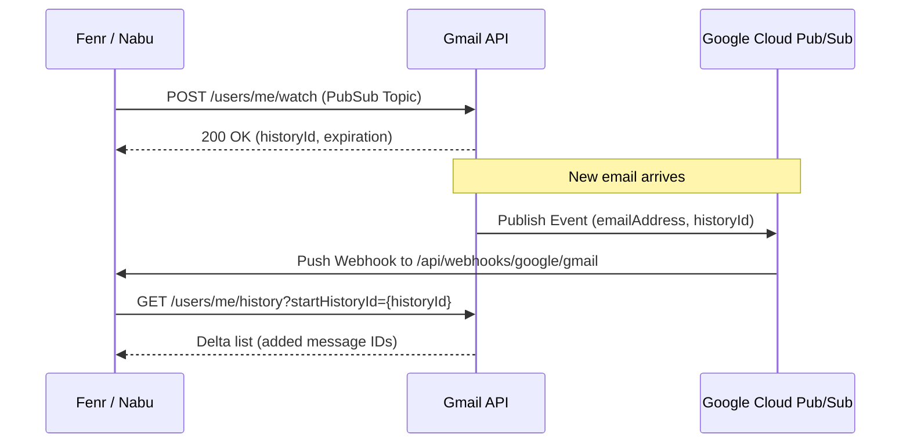

# Gmail Integration Specification

## 1. Overview & Agentic Capabilities

The Gmail integration enables the **Nabu** agent and **Fenr** workspace to:
* **Search & Filter Threads**: Query messages matching queries (e.g. `is:unread from:client@example.com`).
* **Draft Outbound Responses**: Generate context-aware draft replies for human review in Fenr or Gmail.
* **Send Emails**: Send transactional updates, notifications, and client correspondence on behalf of the user.
* **Extract Attachments & Ingest Context**: Extract PDF attachments, invoices, and documents for RAG indexing.

---

## 2. OAuth 2.0 & Scope Classification

Google classifies all scopes accessing user Gmail message bodies as **Restricted Scopes**, which triggers mandatory **CASA (Cloud Application Security Assessment) Tier 2 / Tier 3 external security audits ($3,000–$15,000/year)** for public multi-tenant apps.

```
┌─────────────────────────────────────────────────────────────────────────────┐
│                       GOOGLE OAUTH SCOPE SPECTRUM                           │
│                                                                             │
│  [Non-Sensitive / Sensitive]                [Restricted Scopes (CASA Audit)]│
│  • openid, profile, email                   • https://mail.google.com/      │
│  • https://www.googleapis.com/auth/         • .../auth/gmail.modify         │
│    userinfo.email                           • .../auth/gmail.readonly       │
│                                             • .../auth/gmail.send           │
│                                             • .../auth/gmail.compose        │
└─────────────────────────────────────────────────────────────────────────────┘
```

### The Pragmatic Production Strategy

To avoid the costly CASA security audit:

1. **Google Workspace "Internal" Application Mode**:
   * If Fenr is deployed for an organization using Google Workspace, configure the Google Cloud Console project as **Internal**.
   * **Audit Exemption**: Google explicitly exempts Internal apps from CASA third-party security audits. All scopes (`gmail.modify`, `gmail.send`) operate without restriction or fees.
2. **Domain-Wide Delegation (Service Account)**:
   * Google Workspace admins authorize a Fenr service account with specific OAuth scopes across the domain. No individual user consent prompt or public CASA review required.
3. **Public Multi-Tenant SaaS Fallback**:
   * For non-Workspace public users, **do not request restricted Gmail scopes**.
   * Use user-configured **IMAP/SMTP** or transactional providers (Resend / Postmark) for outbound emails, reserving Google OAuth strictly for Drive/Calendar/Docs/Sheets (which do not require CASA audits when using `drive.file` and `calendar.events`).

### Recommended Scopes

| Scope URI | Google Classification | Audit Trigger? | Purpose |
| :--- | :--- | :--- | :--- |
| `https://www.googleapis.com/auth/gmail.send` | Restricted | **Yes** (Public) / **No** (Internal) | Send messages on behalf of the user. |
| `https://www.googleapis.com/auth/gmail.compose` | Restricted | **Yes** (Public) / **No** (Internal) | Create drafts in user mailbox without full read. |
| `https://www.googleapis.com/auth/gmail.readonly` | Restricted | **Yes** (Public) / **No** (Internal) | Read message content, threads, and attachments. |

---

## 3. Core API Endpoints & Payload Contracts

All Gmail REST calls target `https://gmail.googleapis.com/gmail/v1/users/me/`.

### A. Search Messages
* **Endpoint**: `GET /messages?q={query}&maxResults={count}`
* **Query Syntax**: Standard Gmail search operators (`from:`, `to:`, `subject:`, `has:attachment`, `after:2026/01/01`).
* **Response**: List of message IDs and thread IDs.

### B. Read Message Details
* **Endpoint**: `GET /messages/{id}?format=full`
* **Response Handling**: Extract MIME payload parts (`text/plain` or `text/html`).

### C. Create Message Draft
* **Endpoint**: `POST /drafts`
* **Payload**:
  ```json
  {
    "message": {
      "raw": "<base64url-encoded-RFC2822-mime-string>"
    }
  }
  ```

### D. Send Message
* **Endpoint**: `POST /messages/send`
* **Payload**:
  ```json
  {
    "raw": "<base64url-encoded-RFC2822-mime-string>",
    "threadId": "18f8e02d8e3b1c9a"
  }
  ```

---

## 4. Ingestion & Push Notifications (Webhooks)

Gmail does not use standard HTTP webhooks. It uses **Google Cloud Pub/Sub**:



1. **Watch Request**: Call `POST /users/me/watch` specifying your Google Cloud Pub/Sub topic.
2. **Watch Expiration**: Watch subscriptions expire after **7 days**. A recurring cron task in Nabu or Fenr must renew active watches every 5 days.
3. **Delta Fetching**: Upon receiving a Pub/Sub push event, query `GET /users/me/history?startHistoryId=...` to fetch only mutated messages.

---

## 5. Rate Limits & Quotas

* **Per-User Quota**: 250 quota units per user per second.
* **Costs**:
  * `messages.get`: 5 units.
  * `messages.list`: 5 units.
  * `messages.send`: 100 units.
  * `drafts.create`: 10 units.
* **Error Code**: `429 Too Many Requests` or `403 rateLimitExceeded`.
* **Retry Strategy**: Exponential backoff with jitter (initial delay 1000ms, max 32s).

---

## 6. Nabu Tool Definition (Rust Agent Schema)

```rust
pub struct GmailSendDraftArgs {
    pub recipient: String,
    pub subject: String,
    pub body_markdown: String,
    pub thread_id: Option<String>,
    pub send_immediately: bool, // false = save as draft for user review
}
```
