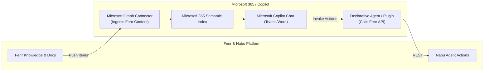

# Microsoft 365 & Copilot Integration Specification

## 1. Overview & Agentic Capabilities

The Microsoft 365 / Copilot integration enables **bi-directional interoperability** between Fenr/Nabu and the Microsoft ecosystem:
* **Fenr Ingestion into Microsoft Copilot (Graph Connectors)**: Index Fenr documents and knowledge into the Microsoft 365 semantic index, allowing Microsoft 365 Copilot to answer questions using Fenr company data.
* **Fenr Action Plugins for Copilot**: Expose Nabu capabilities (e.g. "Create Fenr Project", "Query Fenr Analytics") as declarative plugins accessible directly from within Microsoft 365 Copilot / Teams.
* **Copilot Studio & Declarative Agents**: Deploy standardized OpenAPI specs and adaptive cards that plug Fenr into Word, Teams, and PowerPoint.

---

## 2. Architecture: Graph Connectors vs Declarative Plugins



---

## 3. Microsoft Graph Connectors (Indexing Fenr Data)

Graph Connectors allow Fenr to push content directly into Microsoft Search and Copilot:

### A. Register External Connection
* **Endpoint**: `POST https://graph.microsoft.com/v1.0/external/connections`
* **Payload**:
  ```json
  {
    "id": "fenrKnowledgeBase",
    "name": "Fenr Workspace Documents",
    "description": "Company knowledge and project specs authored in Fenr."
  }
  ```

### B. Register Schema
* Register searchable properties: `title`, `author`, `lastModified`, `content`, `tags`.

### C. Ingest External Item
* **Endpoint**: `PUT https://graph.microsoft.com/v1.0/external/connections/fenrKnowledgeBase/items/{itemId}`
* **Payload**:
  ```json
  {
    "acl": [
      {
        "type": "user",
        "value": "developer@enterprise.com",
        "accessType": "grant"
      }
    ],
    "properties": {
      "title": "Fenr Architecture Specification",
      "content": "Full markdown dump of document...",
      "lastModified": "2026-09-24T12:00:00Z"
    },
    "content": {
      "type": "text",
      "value": "Full searchable plain text string"
    }
  }
  ```

---

## 4. Declarative Copilot Plugin Manifest

To allow Microsoft Copilot users to invoke Fenr/Nabu from Teams or Word, supply a declarative agent manifest:

```json
{
  "$schema": "https://developer.microsoft.com/json-schemas/copilot/declarative-agent/v1.0/schema.json",
  "name": "Fenr Assistant",
  "description": "Create tasks and query projects managed in Fenr.",
  "instructions": "You are the Fenr Assistant. When users request project status, query the Fenr API.",
  "actions": [
    {
      "id": "fenrAction",
      "file": "openapi.yaml"
    }
  ]
}
```

---

## 5. Security & Permission Scopes

* **Graph Connector Push**: Requires Application permissions with admin consent (`ExternalItem.ReadWrite.All`, `ExternalConnection.ReadWrite.All`).
* **Copilot Declarative Plugin**: Secured via OAuth 2.0 (Entra ID Bearer tokens verified by Nabu's Rust auth middleware).
* **Audit Requirement**: **Free Publisher Verification**. No CASA third-party audit fee.
