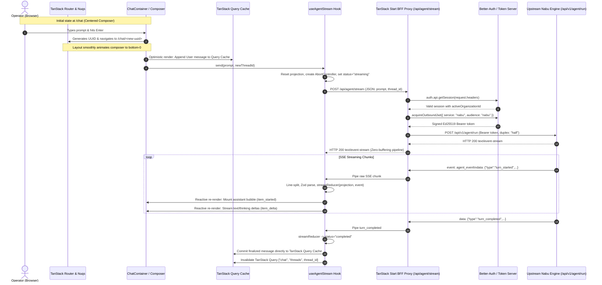

# TanStack Start / React Chat Lifecycle & Architecture Walkthrough

This guide provides an end-to-end architectural overview of how real-time agent chat conversations work in **Fenr** (`apps/web`), from user input in the browser through TanStack Start's BFF (Backend-for-Frontend) proxy to the upstream Rust Nabu execution engine and back to reactive UI rendering.

For exhaustive, step-by-step code traces detailing exact functions, hooks, state transitions, and network payloads, see:
- [Deep Dive 1: Initial Request (Turn 0)](file:///home/muchiri/dev/bag/atelier/fenr/docs/walkthroughs/02_initial_turn_deep_dive.md)
- [Deep Dive 2: Subsequent Request in Same Conversation (Turn 1)](file:///home/muchiri/dev/bag/atelier/fenr/docs/walkthroughs/03_subsequent_turn_deep_dive.md)

---

## 1. The 30-Second Mental Model

To understand the architecture, think of the system as **four distinct roles**:

```text
 ┌────────────────┐       ┌─────────────────┐       ┌──────────────────────┐       ┌──────────────────────┐
 │  1. The Surface│  ──►  │  2. The Bridge  │  ──►  │  3. The Gatekeeper   │  ──►  │    4. The Engine     │
 │ (React / UI)   │       │(Hook & Reducer) │       │(TanStack Start Proxy)│       │ (Rust Nabu Engine)   │
 └────────────────┘       └─────────────────┘       └──────────────────────┘       └──────────────────────┘
         ▲                         │                           │                              │
         │                         ▼                           ▼                              ▼
    Renders Bubbles,          Parses SSE,             Authenticates Session,          Orchestrates Turns,
    Scrolls Feed, &         Validates Zod, &         Mints Outbound EdDSA JWT,       Streams Tokens & Usage,
    Captures Prompts        Projects State            & Pipes Zero-Buffer SSE         & Persists to Postgres
```

1. **The Surface (`apps/web/src/features/chat/components`)**: React UI components composed of `ChatContainer`, `ChatComposer`, `ChatMessages`, `ChatMessageItem`, and `ThinkingTrace`. Manages declarative CSS `field-sizing-content` auto-resizing, hero greeting collapse animations, and Radix `<ScrollArea />` stick-to-bottom mechanics.
2. **The Bridge (`apps/web/src/features/chat/hooks`, `state`)**: The `useAgentStream` hook, Jotai turn projection atoms (`activeTurnProjectionAtom`), and pure `streamReducer`. Reads raw byte streams, splits lines on `\n`, validates event schemas with Zod, and accumulates token deltas without React state tearing.
3. **The Gatekeeper (`apps/web/src/routes/api/agent/stream.ts`)**: TanStack Start server BFF proxy route. Authenticates Better-Auth user sessions, strictly enforces `activeOrganizationId` tenant boundaries, mints short-lived outbound Ed25519 JWTs, and streams upstream SSE with zero buffering.
4. **The Engine (`thebookofnabu`)**: The autonomous Rust runtime. Executes the state machine stepper, calls completion models via `rig-core`, writes items to PostgreSQL, and emits Server-Sent Events back through the pipeline.

---

## 2. High-Level Flow: The Life of a Web Message



---

## 3. Core Architectural Principles

### 3.1 Zero-Buffering SSE Proxying
To prevent proxy latency and memory buffering when relaying LLM tokens to the browser, the TanStack Start server handler in `apps/web/src/routes/api/agent/stream.ts` pipes the upstream `ReadableStream` directly into the downstream `Response`:

```typescript
// apps/web/src/routes/api/agent/stream.ts
response = new Response(nabuResponse.body, {
  status: 200,
  headers: {
    "Content-Type": "text/event-stream",
    "Cache-Control": "no-cache, no-transform",
    Connection: "keep-alive",
    "X-Accel-Buffering": "no",
  },
})
```
- `Cache-Control: no-transform` prevents downstream CDNs, proxies, or compression middleware from buffering chunks.
- `X-Accel-Buffering: no` instructs NGINX/reverse-proxies to flush chunks immediately.
- The browser begins parsing events on the very first byte delivered by the LLM.

### 3.2 URL Routing & TanStack Query State (Zero useState/useEffect)
Fenr enforces a strict anti-pattern avoidance policy:
- **URL Route as Truth**: Conversations begin at `/_app/chat/` (`/chat`) with the composer centered. On first message send, a UUID is generated, navigating to `/_app/chat/$threadId` (`/chat/<uuid>`). URL state is decoupled from Zustand, and `NuqsAdapter` (`nuqs/adapters/tanstack-router`) is mounted at the root.
- **TanStack Query Cache**: Persistent messages are managed strictly by TanStack Query (`threadMessagesQueryOptions(threadId)`), using optimistic cache mutations on message dispatch. No local `useState<ChatMessage[]>` or completion `useEffect` hooks.
- **TanStack Form**: The message composer uses TanStack Form with modern CSS `field-sizing-content` for declarative auto-expanding textareas without refs or imperative height manipulation.

### 3.3 Pure Stream Reducer & Jotai Atoms (No React Tearing)
High-frequency token streams (often 50–100 tokens/sec) can cause React state tearing or dropped frames if handled via scattered `useState` calls. Fenr uses a single pure reducer function (`apps/web/src/features/chat/state/stream-reducer.ts`) and reactive Jotai atoms:

```typescript
export function streamReducer(
  state: ActiveTurnProjection,
  event: AgentStreamEvent,
): ActiveTurnProjection
```
All in-flight state—`streamingText`, `streamingThinking`, `activeItemId`, `turnId`, `threadId`, and `status`—is consolidated into an immutable `ActiveTurnProjection` managed by `activeTurnProjectionAtom`. When `turn_completed` arrives, the final content is atomically committed to the TanStack Query cache.

### 3.4 Zero Layout Jitter
Before generating any tokens, the upstream Nabu stepper emits `item_started` with the PostgreSQL-persisted `item_id`. The client immediately mounts the assistant message bubble with a pulsing cursor. The UI does not jump or reflow when the first text token arrives.

### 3.5 Multi-Timescale Tenant Security
Client-side cookies only identify the browser session to the Fenr BFF. The browser **never** touches or stores the private EdDSA keys used to communicate with the Rust backend.
1. The client browser makes a session-authenticated request to `POST /api/agent/stream`.
2. The BFF extracts `activeOrganizationId` from the Better-Auth session. If missing, it immediately rejects the request with `403 Forbidden`.
3. The BFF mints a dedicated, short-lived (5-minute) outbound JWT signed with the organization's private key for audience `"nabu"`.
4. Rust backend validates the JWT and scopes all database operations to that organization.

---

## 4. The Three Core Conversation Scenarios

### Scenario 1: Starting a New Chat (Turn 0)
1. **Initial Mount**: Navigating to `/chat`. `threadId` is null. The hero greeting and composer are vertically centered (`bottom-1/2 translate-y-1/2`).
2. **User Submission**: The operator enters a prompt in `ChatComposer` and presses Enter.
3. **URL Transition & Optimistic Rendering**: A new `threadId` UUID is created. TanStack Router immediately transitions to `/chat/<uuid>`. The user prompt is optimistically added to TanStack Query cache.
4. **Hero Collapse**: `hasStarted` becomes `true`, smoothly collapsing the greeting and translating the composer to `bottom-0`.
5. **Streaming & Completion**: Tokens stream into the assistant bubble via `activeTurnProjectionAtom`. On `turn_completed`, the completed message is committed to TanStack Query cache.

### Scenario 2: Continuing the Context (Turn 1)
1. **Subsequent Submission**: The operator types a follow-up prompt on `/chat/<uuid>`. The `threadId` is already bound from route params.
2. **Contextual Ingress**: `handleSend(prompt)` sends `{ prompt, thread_id }` to `/api/agent/stream`.
3. **Upstream Forwarding**: Nabu receives the `thread_id`, queries PostgreSQL for the conversation history, and forwards past messages to the LLM.
4. **Reactive Mounting**: The new turn streams below existing messages.
5. **Query Invalidation**: On `turn_completed`, TanStack Query keys are updated and invalidated, ensuring server-persisted history remains synchronized.

### Scenario 3: User Cancellation (Stop Generation)
1. **Stop Trigger**: While tokens are streaming, the send button transforms into a destructive "Stop" icon. The user clicks it.
2. **`AbortController` Signal**: `useAgentStream` invokes `abortControllerRef.current.abort()`.
3. **Transport Tear-Down**:
   - The browser's active `fetch()` connection is aborted.
   - The BFF proxy's outbound request to Nabu is cancelled via `signal: request.signal`.
   - The hook sets `projection.status = "idle"`.
4. **Headless Upstream Completion**: The Rust coordinator catches the closed client connection and proceeds headlessly to write the complete response to PostgreSQL.

---

## 5. SSE Wire Event Reference

The client parses incoming SSE frames tagged `event: agent_event`. Payloads are strictly validated against `agentStreamEventSchema` (`apps/web/src/lib/schemas/agent-stream.ts`):

| Event Type (`type`) | Role in UI Lifecycle | Payload Shape |
| :--- | :--- | :--- |
| `turn_started` | Resets streaming projection; sets active turn status. | `{"thread_id":"uuid","turn_id":"uuid"}` |
| `item_started` | Mounts message bubble in feed with zero layout shift. | `{"thread_id":"uuid","turn_id":"uuid","item_id":"uuid","kind":"agent_message"}` |
| `item_delta` | Appends text or reasoning tokens to in-flight projection atom. | `{"item_id":"uuid","delta":{"kind":"text_delta"\|"thinking_delta","text":"..."}}` |
| `item_completed` | Upstream item persistence confirmation. | `{"item_id":"uuid","payload":{"kind":"agent_message","text":"...","thinking":"..."}}` |
| `turn_completed` | Commits assistant message to TanStack Query; invalidates query. | `{"thread_id":"uuid","turn_id":"uuid","status":"completed","usage":{...}}` |
| `stream_error` | Renders `<Sonner />` error toast and marks projection error. | `{"code":"...","message":"..."}` |

---

## 6. Architecture & Concurrency Summary

| Layer | Responsibility | State Model | Lifecycle / Failure Behavior |
| :--- | :--- | :--- | :--- |
| **`ChatContainer`** | UI layout, URL-driven routing, auto-scroll coordination. | TanStack Router params (`threadId`) + Query Cache | Sourced from URL; clears back to centered `/chat` on "Clear conversation". |
| **`ChatComposer`** | Input validation, keyboard capture, declarative sizing. | TanStack Form + CSS `field-sizing-content` | Zero useState/useEffect; declarative CSS height expansion. |
| **`useAgentStream`** | Transport lifecycle, SSE line buffering, Zod parsing. | React Hook + Jotai atoms (`activeTurnProjectionAtom`) | Manages `AbortController`; cleans up listeners on abort/cancel. |
| **`streamReducer`** | Pure event accumulation without tearing. | Pure Function | Deterministic projection; 100% testable in unit tests. |
| **TanStack Query** | Durable conversation history persistence & cache. | TanStack Query Cache (`['chat', 'thread', threadId, 'messages']`) | Optimistic updates on user send; auto-invalidated on turn completion. |
| **BFF Proxy Route** | Session auth, tenant validation, outbound JWT minting, SSE proxy. | Stateless TanStack Start Route | Emits wide log events via Pino; handles upstream 502/504 errors gracefully. |
