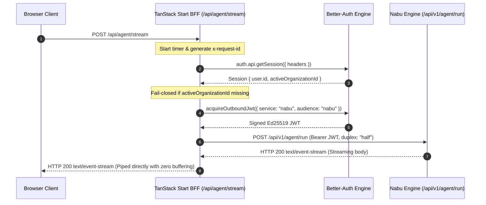

# Step-by-Step Deep Dive: Initial Web Request (Turn 0)

This document provides a code-level, execution-order walkthrough of the agent chat lifecycle in **Fenr** during an initial conversation turn (`thread_id: null`). It covers:
1. **Server Boot & In-Memory State**: Bun production server initialization, static asset caching, and TanStack Start handler registration.
2. **Initial Client Mount State**: Initial values in React state, Zustand (`useChatStore`), and the stream projection.
3. **User Action & Form Validation**: Entering the prompt, TanStack Form validation with Zod (`chatComposerSchema`), and keyboard handling.
4. **Optimistic Rendering & Hook Invocation**: Appending the user message, collapsing the hero greeting, and triggering `useAgentStream.send()`.
5. **TanStack Start BFF Proxy Execution**: Session authentication, tenant boundary validation, outbound Ed25519 JWT minting, and zero-buffering proxying.
6. **Client Stream Processing & Pure Reducer Dispatching**: Reading SSE chunks, Zod schema validation, and pure state projection.
7. **Turn Finalization & UI Commit**: Query cache invalidation, persistent message list commit, and wide-event logging.

---

## 1. Server Boot & In-Memory State

Fenr runs on pure Bun in production via `apps/web/server.ts`:

```typescript
// apps/web/server.ts:76
async function initializeServer() {
  startupLogger.info("starting Fenr production server")

  // 1. Dynamically import TanStack Start compiled SSR server module
  const serverModule = (await import("./dist/server/server.js")) as {
    default: ServerHandler
  }
  const handler = serverModule.default

  // 2. Preload static assets (HTML/JS/CSS/SVG) into memory with ETags
  const { routes } = await initializeStaticRoutes()

  // 3. Start native Bun.serve HTTP server
  const server = Bun.serve({
    port: Number(process.env.PORT ?? 3000),
    routes: {
      ...routes,
      // 4. Fallback all non-static routes to TanStack Start application handler
      "/*": async (req) => handler.fetch(req),
    },
  })
}
```

### 1.1 In-Memory Server Environment
When initialized, the server environment holds:
- **`serverEnv.NABU_SERVER_URL`**: Upstream address of the Rust agent runtime (e.g. `http://127.0.0.1:3001`).
- **`auth`**: Better-Auth server instance connected to PostgreSQL, configured with Ed25519 cryptographic keypairs for signing service-to-service tokens.
- **Static Assets Cache**: Pre-built client assets from `dist/client` cached with immutable `Cache-Control` headers.

---

## 2. Initial Client Mount State

When an operator navigates to `/chat` (`apps/web/src/routes/_app/chat/index.tsx`), TanStack Router mounts `ChatContainer`:

### 2.1 Zustand Global Store (`apps/web/src/lib/stores/chat.store.ts`)
```typescript
{
  activeThreadId: null,
  draftPrompt: "",
  isThinkingOpen: true,
}
```

### 2.2 `useAgentStream` Hook State (`apps/web/src/features/chat/hooks/use-agent-stream.ts`)
```typescript
{
  projection: {
    threadId: null,
    turnId: null,
    activeItemId: null,
    streamingText: "",
    streamingThinking: "",
    status: "idle",
    error: null,
  },
  abortControllerRef: { current: null },
  isStreaming: false,
}
```

### 2.3 `ChatContainer` Local State (`apps/web/src/features/chat/components/chat-container.tsx`)
- `messages`: `[]` (empty array).
- `hasStarted`: `false`.
- **UI Layout**: Because `hasStarted` is false, the hero greeting (`"How can Nabu assist you today?"`) is vertically centered (`bottom-1/2 translate-y-1/2`).

---

## 3. User Action & Form Validation

The operator types their query into the `ChatComposer` textarea.

### 3.1 Form Validation (`apps/web/src/features/chat/components/chat-composer.tsx`)
TanStack Form validates input using Zod standard schema (`apps/web/src/lib/schemas/agent-stream.ts`):

```typescript
export const chatComposerSchema = z.object({
  prompt: z
    .string()
    .trim()
    .min(1, "Message cannot be empty")
    .max(10_000, "Message is too long"),
})
```

1. **Auto-Resize**: As the user types, `adjustHeight()` sets `textareaRef.current.style.height` to `Math.min(scrollHeight, 200)px`.
2. **Keyboard Capture**:
   ```typescript
   onKeyDown={(e) => {
     if (e.key === "Enter" && !e.shiftKey) {
       e.preventDefault()
       if (!isStreaming && field.state.value.trim().length > 0) {
         void form.handleSubmit()
       }
     }
   }}
   ```
   Pressing Enter submits the form; Shift+Enter inserts a newline.

---

## 4. Optimistic Rendering & Hook Invocation

When the form submits, `ChatContainer.handleSend(prompt)` executes:

```typescript
// apps/web/src/features/chat/components/chat-container.tsx:55
const handleSend = async (prompt: string) => {
  const userMsg: ChatMessage = {
    id: crypto.randomUUID(),
    role: "user",
    content: prompt,
    createdAt: "Just now",
  }
  setMessages((prev) => [...prev, userMsg])
  await send(prompt, activeThreadId) // activeThreadId is null
}
```

### 4.1 UI Transitions
1. **Optimistic Message Insertion**: The user message bubble immediately appears in the message feed.
2. **Hero Greeting Collapse**: `hasStarted` becomes `true`. The hero greeting collapses with a 500ms spring animation (`opacity-0 max-h-0 -translate-y-4 scale-95 overflow-hidden`), and the composer translates smoothly to the bottom of the viewport (`bottom-0 translate-y-0 pb-6`).

### 4.2 Initiating `useAgentStream.send()`
In `apps/web/src/features/chat/hooks/use-agent-stream.ts`:
1. Cleans up any prior requests: `stop()`.
2. Allocates a new `AbortController`:
   ```typescript
   const abortController = new AbortController()
   abortControllerRef.current = abortController
   ```
3. Sets stream projection to streaming:
   ```typescript
   setProjection({
     ...initialTurnProjection,
     threadId: null,
     status: "streaming",
   })
   ```
4. Dispatches the HTTP fetch request:
   ```typescript
   const response = await fetch("/api/agent/stream", {
     method: "POST",
     headers: {
       "Content-Type": "application/json",
       Accept: "text/event-stream",
     },
     body: JSON.stringify({
       prompt: "What is the invoice status for Initech?",
       thread_id: undefined,
     }),
     signal: abortController.signal,
   })
   ```

---

## 5. TanStack Start BFF Proxy Execution

The fetch hits `apps/web/src/routes/api/agent/stream.ts:handleAgentStreamRequest`.



### Step 5.1: Session Authentication
```typescript
const session = await auth.api.getSession({ headers: request.headers })
if (!session?.user?.id) {
  return Response.json({ error: "Unauthorized" }, { status: 401 })
}
```
Better-Auth verifies the session cookie and resolves the user ID: `"usr_0195c1a2-b3c4-7d5e-8f90-112233445566"`.

### Step 5.2: Tenant Boundary Enforcement
```typescript
const activeOrgId = session.session?.activeOrganizationId
if (!activeOrgId) {
  return Response.json(
    { error: "Tenant context required: active organization context is missing" },
    { status: 403 },
  )
}
tenantId = activeOrgId // "org_initech_corp"
```
The proxy fails-closed if no active tenant organization is selected.

### Step 5.3: Mint Outbound JWT
```typescript
const token = await acquireOutboundJwt(
  { type: "authenticated", service: "nabu", audience: "nabu" },
  { headersSource: request.headers },
)
```
In `apps/web/src/lib/http/token.server.ts`:
- Signs a new Ed25519 JWT valid for 5 minutes.
- Sets payload claims: `sub: user.id`, `activeOrganizationId: "org_initech_corp"`, `aud: "nabu"`.

### Step 5.4: Upstream Request & Zero-Buffering Response
```typescript
const nabuUrl = `${serverEnv.NABU_SERVER_URL.replace(/\/+$/, "")}/api/v1/agent/run`
const nabuResponse = await fetch(nabuUrl, {
  method: "POST",
  headers: {
    Authorization: `Bearer ${token}`,
    "Content-Type": "application/json",
    Accept: "text/event-stream",
    "X-Request-Id": requestId,
  },
  body: JSON.stringify(payload),
  // @ts-expect-error duplex required for streaming request body in Bun/Node
  duplex: "half",
  signal: request.signal,
})

return new Response(nabuResponse.body, {
  status: 200,
  headers: {
    "Content-Type": "text/event-stream",
    "Cache-Control": "no-cache, no-transform",
    Connection: "keep-alive",
    "X-Accel-Buffering": "no",
  },
})
```
The upstream `nabuResponse.body` is streamed directly to the browser with zero intermediate memory accumulation.

---

## 6. Client Stream Processing & Pure Reducer Dispatching

In `useAgentStream`, the browser acquires a reader:

```typescript
const reader = response.body.getReader()
const decoder = new TextDecoder()
let buffer = ""

while (true) {
  const { value, done } = await reader.read()
  if (done) break

  buffer += decoder.decode(value, { stream: true })
  const lines = buffer.split("\n")
  buffer = lines.pop() ?? ""

  for (const line of lines) {
    if (line.trim().startsWith("data:")) {
      const rawJson = line.trim().slice(5).trim()
      const parsed = JSON.parse(rawJson)
      const validation = agentStreamEventSchema.safeParse(parsed)
      if (validation.success) {
        setProjection((prev) => streamReducer(prev, validation.data))
        // Handle side effects...
      }
    }
  }
}
```

### 6.1 Event Trace & State Transitions

#### Event 1: `turn_started`
- **Wire Payload**:
  ```json
  {"type":"turn_started","data":{"thread_id":"0195c100-aaaa-7000-8000-000000000001","turn_id":"0195c100-bbbb-7000-8000-000000000001"}}
  ```
- **Reducer Action**:
  ```typescript
  return {
    ...state,
    threadId: event.data.thread_id,
    turnId: event.data.turn_id,
    streamingText: "",
    streamingThinking: "",
    status: "streaming",
    error: null,
  }
  ```
- **Side Effect**:
  ```typescript
  useChatStore.getState().setActiveThreadId(event.data.thread_id)
  ```
  The thread ID is stored in Zustand, binding all future prompts in this session to the thread.

#### Event 2: `item_started`
- **Wire Payload**:
  ```json
  {"type":"item_started","data":{"thread_id":"...","turn_id":"...","item_id":"0195c100-dddd-7000-8000-000000000001","kind":"agent_message"}}
  ```
- **Reducer Action**:
  ```typescript
  return { ...state, activeItemId: event.data.item_id }
  ```
- **UI Render**:
  `ChatMessages` detects `hasActiveStreaming = true` and renders:
  ```tsx
  <ChatMessageItem
    message={{
      id: projection.activeItemId, // "0195c100-dddd-..."
      role: "agent",
      content: "",
      thinking: null,
    }}
    isStreaming={true}
  />
  ```
  The assistant bubble mounts with the agent avatar and a pulsing cursor. Because `activeItemId` matches the database key, no DOM re-keying occurs later.

#### Event 3: `item_delta` (Thinking)
- **Wire Payload**:
  ```json
  {"type":"item_delta","data":{"item_id":"...","delta":{"kind":"thinking_delta","text":"Checking ledger..."}}}
  ```
- **Reducer Action**: Appends text to `state.streamingThinking`.
- **UI Render**: `<ThinkingTrace />` renders a collapsible thinking badge displaying the stream in real-time.

#### Event 4: `item_delta` (Text)
- **Wire Payload**:
  ```json
  {"type":"item_delta","data":{"item_id":"...","delta":{"kind":"text_delta","text":"Invoice #INV-2024-001 is PAID."}}}
  ```
- **Reducer Action**: Appends text to `state.streamingText`.
- **UI Render**: `<ChatMessageItem />` updates the text stream smoothly.
- **Scroll Stickiness**: `ChatMessages` checks `isAtBottomRef.current`. If the user has not scrolled up, it auto-scrolls down:
  ```typescript
  viewportRef.current.scrollTop = viewportRef.current.scrollHeight
  ```

#### Event 5: `turn_completed`
- **Wire Payload**:
  ```json
  {"type":"turn_completed","data":{"thread_id":"...","turn_id":"...","status":"completed","usage":{"prompt_tokens":15,"completion_tokens":10,"total_tokens":25}}}
  ```
- **Reducer Action**: Sets `status: "completed"`.
- **Side Effect**:
  ```typescript
  queryClient.invalidateQueries({
    queryKey: ["chat", "threads", event.data.thread_id],
  })
  ```
  Triggers background refetch of any sidebar thread list components.

---

## 7. Turn Finalization & UI Commit

When `projection.status` transitions to `"completed"`, `ChatContainer` commits the streaming message:

```typescript
// apps/web/src/features/chat/components/chat-container.tsx:31
useEffect(() => {
  if (projection.status === "completed" && projection.streamingText) {
    setMessages((prev) => [
      ...prev,
      {
        id: projection.activeItemId || projection.turnId || crypto.randomUUID(),
        role: "agent",
        content: projection.streamingText,
        thinking: projection.streamingThinking || null,
        createdAt: "Just now",
      },
    ])
    reset() // Resets projection to initialTurnProjection (status: "idle")
  }
}, [projection.status, projection.streamingText, projection.streamingThinking, reset])
```

1. **State Persistence**: The assistant response is committed into the persistent `messages` array in React state.
2. **Projection Reset**: `reset()` returns `projection.status` to `"idle"` and clears `streamingText`. The pulsing cursor disappears, and message action buttons (e.g. Copy to Clipboard) appear.
3. **Wide Event Logging**: In the BFF proxy's `finally` block, Pino logs a wide JSON event:
   ```json
   {
     "service": "fenr",
     "mod": "api.agent.stream",
     "action": "/api/agent/stream",
     "method": "POST",
     "requestId": "0195c100-demo-trace-0001",
     "timestamp": "2026-09-25T15:18:00.000Z",
     "status_code": 200,
     "outcome": "success",
     "duration_ms": 142,
     "tenantId": "org_initech_corp"
   }
   ```
