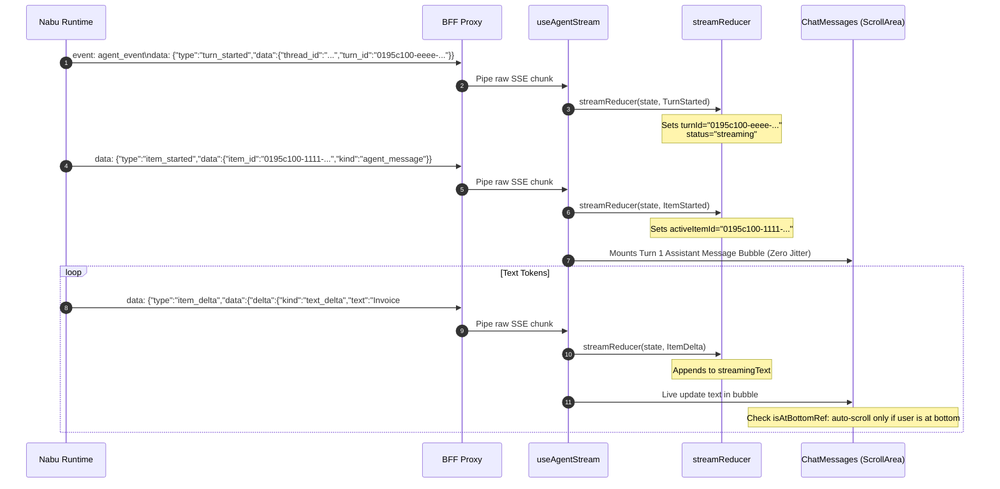

# Step-by-Step Deep Dive: Subsequent Web Request & Cancellation (Turn 1)

This document provides a code-level, execution-order walkthrough of the agent chat lifecycle in **Fenr** during a **subsequent conversation turn (`thread_id: Some(...)`)** within an existing chat session.

It builds directly upon the state created in [Deep Dive 1: Initial Web Request (Turn 0)](file:///home/muchiri/dev/bag/atelier/fenr/docs/walkthroughs/02_initial_turn_deep_dive.md), focusing on:
1. **Pre-Existing Frontend & Store State**: Zustand store, local message arrays, and layout anchors prior to Turn 1.
2. **Subsequent User Submission**: Form submission carrying the existing `thread_id`.
3. **BFF Proxy Execution for Existing Threads**: Forwarding conversation context and tenant validation.
4. **Reactive Multi-Turn Streaming**: Feed rendering, non-fighting auto-scroll, and the floating scroll button.
5. **Turn 1 Finalization & Query Invalidation**: Multi-item commit and cache synchronization.
6. **Cancellation & Abort Mechanics**: Detailed breakdown of what happens when an operator stops generation mid-stream.

---

## 1. Pre-Existing Frontend & Store State (Turn 1 Ingress)

At the conclusion of Turn 0, the client application holds:

### 1.1 Zustand Store (`apps/web/src/lib/stores/chat.store.ts`)
```typescript
{
  activeThreadId: "0195c100-aaaa-7000-8000-000000000001",
  draftPrompt: "",
  isThinkingOpen: true,
}
```

### 1.2 `ChatContainer` Local State (`apps/web/src/features/chat/components/chat-container.tsx`)
`messages` contains the two completed messages from Turn 0:
```typescript
[
  {
    id: "0195c100-cccc-7000-8000-000000000001",
    role: "user",
    content: "What is the invoice status for Initech?",
    createdAt: "Just now",
  },
  {
    id: "0195c100-dddd-7000-8000-000000000001",
    role: "agent",
    content: "Invoice #INV-2024-001 is PAID.",
    thinking: "Checking ledger...",
    createdAt: "Just now",
  }
]
```

### 1.3 UI Layout Anchor
- `hasStarted`: `true`.
- The hero greeting is completely collapsed (`opacity-0 max-h-0`).
- The composer bar is docked at the bottom of the conversational canvas (`bottom-0 translate-y-0`).

---

## 2. Subsequent User Submission

The operator enters a follow-up query:
> *"Can you summarize the line items for that invoice?"*

### 2.1 Form Submission (`apps/web/src/features/chat/components/chat-composer.tsx`)
1. User presses Enter.
2. `form.handleSubmit()` validates against `chatComposerSchema`.
3. `ChatContainer.handleSend(prompt)` is called:
   ```typescript
   // apps/web/src/features/chat/components/chat-container.tsx:55
   const handleSend = async (prompt: string) => {
     const userMsg: ChatMessage = {
       id: crypto.randomUUID(),
       role: "user",
       content: prompt,
       createdAt: "Just now",
     }
     setMessages((prev) => [...prev, userMsg])
     await send(prompt, activeThreadId) // activeThreadId = "0195c100-aaaa-..."
   }
   ```
4. **Optimistic UI Update**: Message 3 (User) is immediately appended to the feed, and the scroll view snaps smoothly to the bottom.

---

## 3. BFF Proxy Execution for Existing Threads

`useAgentStream.send()` issues a POST request to `/api/agent/stream`:

```typescript
fetch("/api/agent/stream", {
  method: "POST",
  headers: {
    "Content-Type": "application/json",
    Accept: "text/event-stream",
  },
  body: JSON.stringify({
    prompt: "Can you summarize the line items for that invoice?",
    thread_id: "0195c100-aaaa-7000-8000-000000000001",
  }),
  signal: abortController.signal,
})
```

### 3.1 BFF Proxy Route (`apps/web/src/routes/api/agent/stream.ts`)
1. **Authentication & Tenant Check**:
   - `auth.api.getSession` verifies the caller's active session.
   - Extracts `activeOrganizationId = "org_initech_corp"`.
2. **Outbound JWT Minting**:
   - `acquireOutboundJwt` generates a signed Ed25519 JWT asserting `sub: user_id`, `activeOrganizationId: "org_initech_corp"`, `aud: "nabu"`.
3. **Upstream Forwarding**:
   - Dispatches upstream request to `NABU_SERVER_URL/api/v1/agent/run` with the payload carrying `thread_id: "0195c100-aaaa-..."`.
4. **Upstream Nabu Execution**:
   - Nabu queries PostgreSQL for `thread_id: "0195c100-aaaa-..."`.
   - Nabu verifies that the thread belongs to `"org_initech_corp"`.
   - Nabu retrieves Turn 0 messages, constructs the LLM context, increments the turn index to `1`, and begins streaming SSE events.
5. **Zero-Buffering Pipe**:
   - Proxy pipes `nabuResponse.body` directly back to the browser.

---

## 4. Reactive Multi-Turn Streaming & UI Coordination

As SSE chunks arrive at `useAgentStream`, the events flow into `streamReducer`:



### 4.1 Non-Fighting Auto-Scroll Mechanics
In `apps/web/src/features/chat/components/chat-messages.tsx`:

```typescript
// Detect whether operator has scrolled up to inspect previous turns
const handleScroll = (e: React.UIEvent<HTMLDivElement>) => {
  const target = e.currentTarget
  const threshold = 80
  const distanceFromBottom =
    target.scrollHeight - target.scrollTop - target.clientHeight
  const atBottom = distanceFromBottom <= threshold
  isAtBottomRef.current = atBottom
  setShowScrollBottom(!atBottom && messages.length > 0)
}

// Token streaming scroll effect
useEffect(() => {
  if (
    isStreaming &&
    streamingContent &&
    isAtBottomRef.current &&
    viewportRef.current
  ) {
    viewportRef.current.scrollTop = viewportRef.current.scrollHeight
  }
}, [isStreaming, streamingContent])
```

- **Stick-to-Bottom**: If the operator is already at the bottom, incoming tokens automatically scroll the view down.
- **Reading Earlier Turns**: If the operator scrolls up by more than 80px to re-read Turn 0, `isAtBottomRef.current` becomes `false`. Auto-scrolling immediately halts, allowing unhindered reading without jumping.
- **Scroll to Bottom Button**: A floating button with `ArrowDown01Icon` appears at the bottom-right. Clicking it smoothly animates back to the newest message.

---

## 5. Turn 1 Finalization & Query Invalidation

### 5.1 Event: `turn_completed`
When Nabu finishes streaming, it emits:
```json
{
  "type": "turn_completed",
  "data": {
    "thread_id": "0195c100-aaaa-7000-8000-000000000001",
    "turn_id": "0195c100-eeee-7000-8000-000000000001",
    "status": "completed",
    "usage": {
      "prompt_tokens": 42,
      "completion_tokens": 28,
      "total_tokens": 70
    }
  }
}
```

1. **Reducer Update**: `projection.status` transitions from `"streaming"` to `"completed"`.
2. **TanStack Query Invalidation**:
   ```typescript
   // apps/web/src/features/chat/hooks/use-agent-stream.ts:131
   if (event.type === "turn_completed") {
     void queryClient.invalidateQueries({
       queryKey: ["chat", "threads", event.data.thread_id],
     })
   }
   ```
   Ensures that thread titles, timestamps, or history lists maintained by TanStack Query are refetched in the background.

### 5.2 Committing Turn 1 Message to React State
`ChatContainer` commits the streaming message into the permanent `messages` array:
```typescript
setMessages((prev) => [
  ...prev,
  {
    id: "0195c100-1111-7000-8000-000000000001",
    role: "agent",
    content: "Invoice #INV-2024-001 includes: 1. Software Subscription ($2,400.00), 2. Professional Services ($1,850.00).",
    thinking: null,
    createdAt: "Just now",
  },
])
reset() // Resets stream projection to idle
```

The conversational feed now holds **4 total messages**:
- `[0]`: Turn 0 User
- `[1]`: Turn 0 Agent
- `[2]`: Turn 1 User
- `[3]`: Turn 1 Agent

---

## 6. Cancellation & Abort Mechanics (Stop Generation)

What happens if the operator clicks the red "Stop" button while the LLM is generating tokens?

```mermaid
sequenceDiagram
    autonumber
    actor User as Operator
    participant UI as ChatComposer
    participant Hook as useAgentStream
    participant Fetch as Browser fetch()
    participant BFF as TanStack Start Proxy
    participant Nabu as Nabu Engine

    User->>UI: Clicks "Stop Generating" (StopCircleIcon)
    UI->>Hook: stop()
    Note over Hook: abortControllerRef.current.abort()
    Hook->>Fetch: AbortSignal triggered (AbortError)
    Hook->>Hook: projection.status = "idle"
    
    Fetch->>BFF: Closes client HTTP connection
    Note over BFF: request.signal aborts outbound fetch
    BFF->>Nabu: Closes upstream HTTP socket

    Note over Nabu: Coordinator catches dropped socket:<br/>"Client SSE disconnected; continuing turn headlessly"<br/>Nabu finishes turn & commits complete response to Postgres
```

### 6.1 Code-Level Cancellation Flow

1. **User Action**: While `isStreaming = true`, `ChatComposer` renders:
   ```tsx
   <button
     type="button"
     aria-label="Stop generating"
     onClick={onStop}
     className="flex size-8 items-center justify-center rounded-xl bg-destructive text-destructive-foreground"
   >
     <HugeiconsIcon icon={StopCircleIcon} size={16} />
   </button>
   ```
2. **Hook Execution (`useAgentStream.stop`)**:
   ```typescript
   // apps/web/src/features/chat/hooks/use-agent-stream.ts:32
   const stop = useCallback(() => {
     if (abortControllerRef.current) {
       abortControllerRef.current.abort()
       abortControllerRef.current = null
       setProjection((prev) =>
         prev.status === "streaming" ? { ...prev, status: "idle" } : prev,
       )
     }
   }, [])
   ```
3. **Graceful Error Suppression**:
   The active `fetch()` reader throws an `AbortError`. The catch handler in `useAgentStream` inspects the error:
   ```typescript
   if (
     (err instanceof DOMException && err.name === "AbortError") ||
     (err instanceof Error && err.name === "AbortError")
   ) {
     return // Silently exit; do not show error toast
   }
   ```
   No jarring error toasts are displayed to the user.
4. **Proxy Cancellation Propagation**:
   The browser drops the HTTP connection to `/api/agent/stream`. The `request.signal` in the BFF route triggers:
   ```typescript
   const nabuResponse = await fetch(nabuUrl, {
     // ...
     signal: request.signal,
   })
   ```
   The outbound fetch to Nabu is cancelled, releasing the BFF proxy connection immediately.
5. **Headless Upstream Resilience**:
   In the Rust engine, the coordinator's event channel receiver drops. The engine catches this and proceeds headlessly, ensuring the full response is safely written to PostgreSQL without leaving orphaned or corrupted database records.
